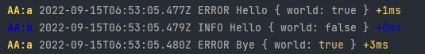

SLF Debug Driver
======

[SLF Debug Driver](https://github.com/surikaterna/slf-debug) is a factory for
using [Debug.js](https://github.com/debug-js/debug) for
logging [SLF](https://github.com/surikaterna/slf) events.

* [Purpose](#purpose)
* [Installation](#installation)
* [Usage](#usage)

# Purpose

Provide colored logs with timestamps and debug level info to the terminal.



# Installation

Install the _SLF Debug Driver_ as well as _Debug.js_

```shell
npm install slf-debug debug
```

# Usage

Provide the SLF Debug Driver as the factory when configuring SLF. Use Debug.js to configure which logs should be
displayed.

```typescript
import debug from 'debug';
import { LoggerFactory } from 'slf';
import slfDebug from 'slf-debug';

debug.enable('viewdb:*');
LoggerFactory.setFactory(slfDebug);
```
